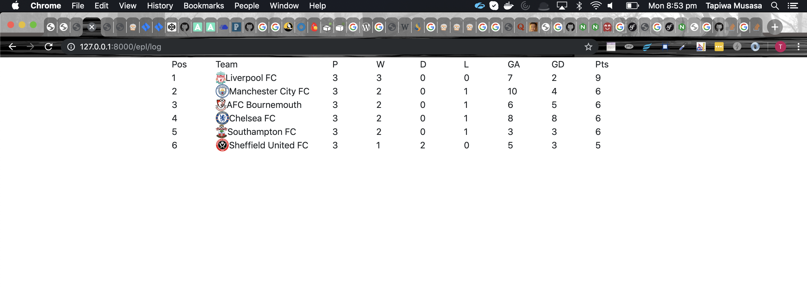
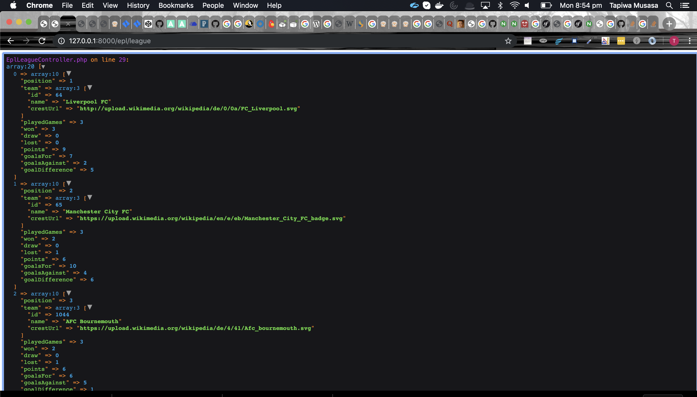
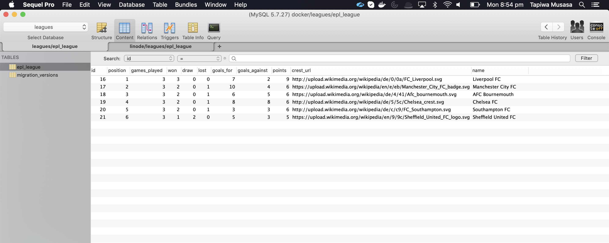

# epl
an epl symfony poc app

## Project notes
1. This project gets the data from the football data api https://www.football-data.org/documentation a free version just 10 API calls
2. Created the EplLeague entity and extend in EplLeagueController class
3. We are updating the data by visiting /epl/league link manually atm
4. We then query the db entity objects and render in twig and with vue components

## Frameworks
1. Symfony
2. Doctrine
3. Vue js
4. Mysql

## Screenshots
1. Final look (css love missing), filtered only and getting top 6 only enough to get to Europa league

## Screenshots Note its free version and only pulling out first 3 games
1. API calls all 20 teams
2. API URL http://api.football-data.org/v2/competitions/2021/standings 
3. API X-Auth-Token: 7213f04fd627456dae738b6ac302e26f

 
 
## Screenshot Database
1. After running migration script ./bin/console doctrine:migrations:migrate
